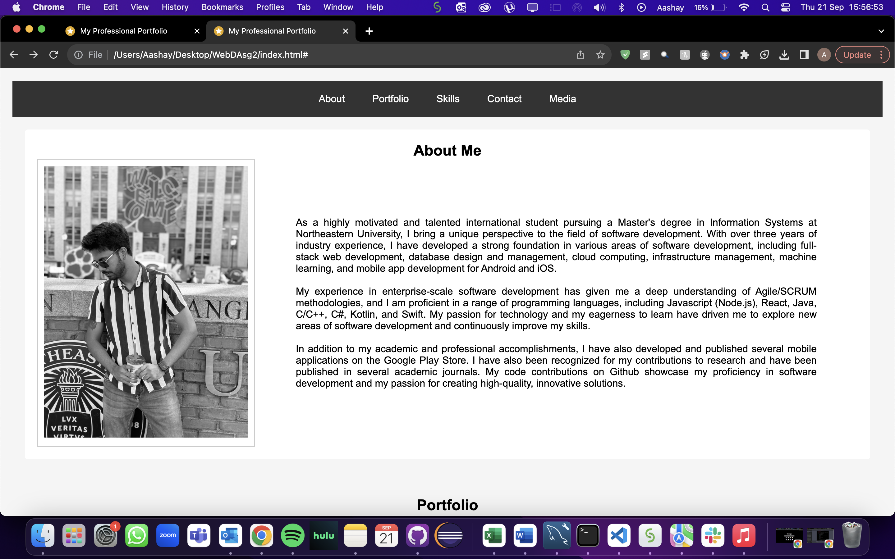
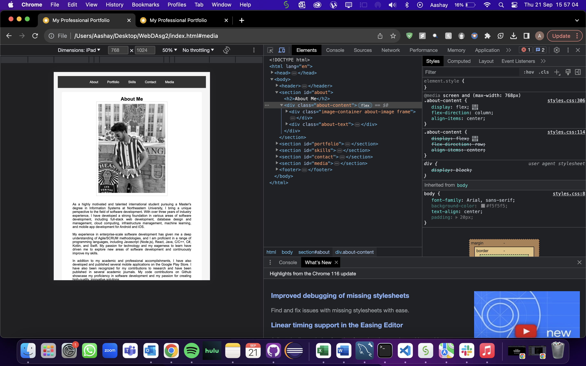
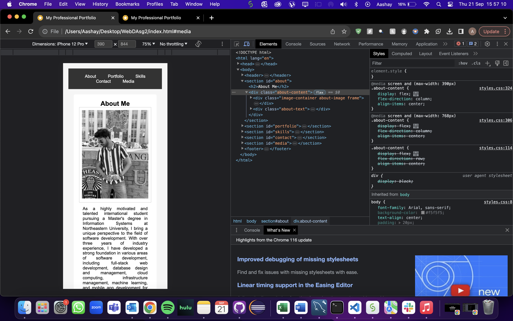

Name:
NUID:
Email:

<h2>Assignment-2</h2>

Create your professional portfolio website (like LinkedIn Professional portfolio) and add the content accordingly. Here below are the additional guidelines:

Below, HTML and HTML5 controls MUST be there, and feel free to add more HTML and HTML5 controls.

<h3>1. Favicon</h3>
Line 9
Used Favicon for webpage icon.

<h3>2. Table</h3>
Line 75
Used table to display programming skills

<h3>3. Form</h3>
Line 113
Used form for name, email and message

<h3>4. Images</h3>
Line 30 & in menu tags Line 57
Used images in about section and portfolio section

<h3>5. Hyperlink</h3>
Line 32 & in menu tags Line 57
Hyperlinks in buttons and profile picture image

<h3>6. Button</h3>
Line 127, 151, in form as submit button and in footer
Buttons in portfolio and in footer

<h3>7. Audio</h3>
Line 135
Included an audio file

<h3>8. Video</h3>
Line 144
Included a video file

<h3>9. Header</h3>
Line 13
Header has section tags

<h3>10. Footer</h3>
Line 150
Footer has copyright and a button

<h3>11. Summary</h3>
Line 41
Summary is in the about section

<h3>12. Menu</h3>
Line 57
Menu to display in portfolio

<h3>13. Tel for Contact Information</h3>
Line 111
hyperlinks for tel

<h3>14. Mailto for Contact Information</h3>
Line 109
hyperlinks for email

<h3>1. Use an external CSS file only.</h3>
Used

<h3>2. Use of 'float' and 'overflow' property</h3>
<Used

<h3>3. Use of column layout structure</h3>
Used in About section, flexbox used

<h3>4. Use of absolute and relative position whenever necessary</h3>
Used

<h3>5. Add a table, then style the table using CSS selectors. Guide for CSS Selectors - <a href="http://www.w3schools.com/cssref/css_selectors.asp" target="_blank">http://www.w3schools.com/cssref/css_selectors.asp</a></h3>
Used

<h3>6. Create a professional image gallery for certifications, etc., with hover effects and figure captions. Include this in your portfolio.</h3>
Used in Portfolio section

<h3>7. Make the website responsive using media queries for devices like iPad(768px) and Smart phones (350 – 365px). For example, below pic is a sample (scroll down 2nd page)</h3>
Used media queries for iPhone 12 Pro (390px) and iPad (768px)

<h3>8. There is more weightage on the responsiveness of the page and media query implementation. Fail to implement will be reflected in the grading.</h3>
Yes

<h3>9. Include the readme.txt/readme.md file and include all the tags used and give a short description</h3>
Included

<h3>10. The assignment must be submitted on your PRIVATE GitHub account (use Northeastern email account). The zip file must be submitted on CANVAS, and the GitHub URL of the assignment must be in the canvas remarks.</h3>
Yes

